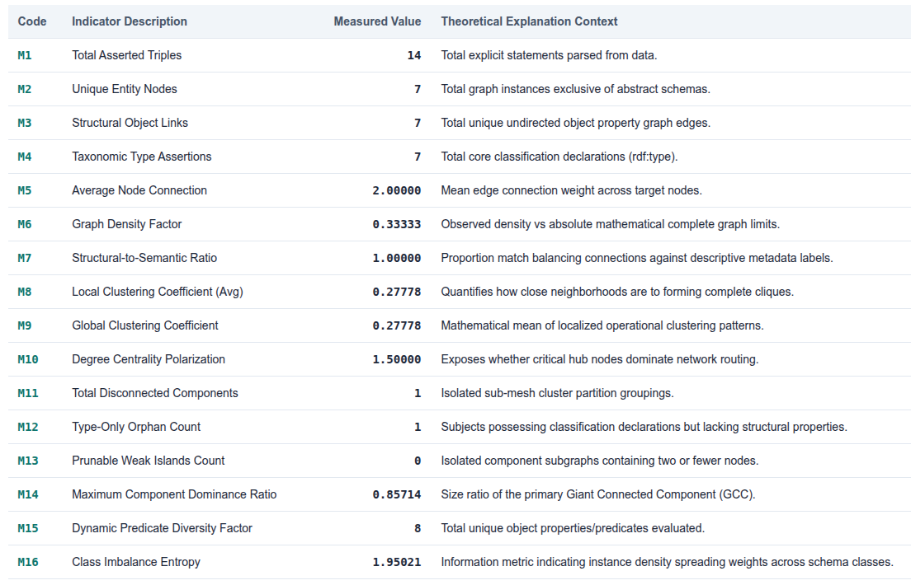

[](https://opensource.org/licenses/MIT)
[](https://www.python.org/downloads/release/python-3120/)
[](https://github.com/saidfathalla/TAGS/actions)
[](https://www.go-fair.org/fair-principles/)
[](https://www.w3.org/RDF/)

# TAGS: Topological Analysis of Graph Structure

**TAGS** (Topological Analysis of Graph Structure), an extended multi-pass graph profiling framework containing sixteen topological and semantic metrics designed specifically to decouple classification vocabularies from instance graph topologies. 

Unlike standard network profilers that treat all RDF triples as structural edges—leading to "semantic inflation"— TAGS isolates pure relational instance data to calculate meaningful topological metrics for quality assurance, index tuning, and database optimization.

## Key Features

## Features

* **Two-Pass Algorithmic Decoupling**: isolates ontological schema layers from raw instance connections, ensuring completely accurate graph metrics without metadata path distortion.
* **High-Performance Processing**:  optimized in-memory data structures and localized neighborhood traversals, entirely eliminating heavy, external graph framework overhead.
* **Comprehensive Metric Taxonomy**: calculates 16 core structural parameters ($M_1 \text{--} M_{16}$), tracking local sub-clique densities, centralities, and component topologies.
* **Semantic Quality Diagnostics**: measures abstract network health properties, such as Class Imbalance Shannon Entropy and Type-Only Orphan Node counts.
* **Triplestore Optimization Insights**: computes actionable topological indicators—like Degree Centrality Polarization—to drive database query planning, index selection, and subgraph caching strategies.
* **VoID Metadata Export**: serializes analytical profiles into standardized W3C VoID metadata for instant machine discovery.
* **Production-Ready CI/CD Validation**: features an integrated test suite checking against a mathematically derived ground-truth baseline.

## Installation

### Prerequisites
* Python 3.8+
* `pip` package manager
* Virtual environment framework (`venv` or `conda`, recommended)

### Core Dependencies
The pipeline engine automatically manages or builds upon the following foundational semantic and analytical runtimes:
* **`rdflib`**: For core W3C RDF parsing, graph manipulation, and Turtle serialization.
* **`numpy`**: For optimized array indexing and matrix computation within topology loops.
* **`matplotlib`** (Optional): For rendering high-impact matrix co-occurrence and class density visualizations in headless environments.

### Install dependencies:
We recommend using a virtual environment.

   ```bash
	pip install -r requirements.txt
   ```

### Usage
TAGS is designed as a command-line tool. Run the profiler by pointing it to your RDF Turtle (.ttl) file. 
- **Default output:** By default, the pipeline automatically resolves an absolute path relative to the script location and safely routes all outputs directly to `../output/`:

   ```bash
	python3 tags.py ./examples/hkg_sample_triples_9.ttl 
   ```
- **Custom Output:** To explicitly direct all generated payloads, visualizations, and summary files into a targeted storage destination, use the `-o` or `--output-dir` parameter:

   ```bash
  python3 tags.py ./examples/hkg_sample_triples_9.ttl  -o /path/to/custom_output/
   ```
 - **Help Configuration Options:** To view the command-line interface helper configurations and flags, run:
  
  	```bash
  	python3 tags.py --help
   ```
   
   

 
### Outputs
Upon compilation, the TAGS engine writes three unified output layers to your chosen output directory:

* Terminal Dashboard: A structurally aligned terminal printout mapping out calculated values for all 16 indicators alongside top discovered high-degree topological hubs.

* W3C VoID Metadata (`*_void.ttl`): A fully compliant, machine-actionable Turtle semantic file indexing distinct nodes, subject/object properties, and sub-class partitions for catalog ingestion.

* Visual Analytics Dashboard (`*_dashboard.html`): A responsive, self-contained HTML report embedding Base64-encoded visual frameworks, including the Dynamic Predicate Co-occurrence Matrix and Taxonomic Class Density Profiles. 


## Testing & Quality Assurance

This project utilizes `pytest` to ensure structural analysis metrics remain consistent across updates. We maintain a CI/CD pipeline using GitHub Actions to validate code integrity on every push automatically.

```bash
pip install pytest
python3 -m pytest
```
The test suite validates the core `analyze_knowledge_graph` logic against a synthetic graph to ensure parsing accuracy and stability of metric computation. The following figure shows the results of the baseline test graph.



### Running Tests Locally
We recommend running tests before submitting changes to ensure local logic parity. Ensure you have installed the development dependencies:

```bash
pip install -r requirements.txt
python3 -m pytest
```
The test suite validates the core analyze_knowledge_graph logic against a synthetic graph to ensure parsing accuracy and stability of metric computation. 

### Empirical Large-Scale Validation (Berlin Use Case)

To demonstrate the computational viability and structural diagnostic utility of TAGS on production-scale data, the engine was stress-tested against a dense, highly centralized real-world knowledge graph asset centered on the city of Berlin harvested from DBpedia ([DBpedia-mini-samples-Berlin.ttl](http://dbpedia.org/data/Berlin.ttl)).

```bash
python3 src/run_scale_test.py ../examples/Large-scale-data/DBpedia-mini-samples-Berlin.ttl
```
The framework successfully executed the entire 16-metric extraction matrix on standard commodity hardware with the following resource profiles:

| Evaluation Attribute                   | Empirical Value |
|----------------------------------------|-----------------|
| Total Asserted Triples (M1​)           | 53,228 triples  |
| Unique Entity Nodes (M2​)              | 40,335 vertices |
| Structural Object Links (M3​)          | 41,677 links    |
| Average Node Connection (M5​)          | 2.06654         |
| Degree Centrality Heterogeneity (M10​) | 20,167.50       |
| Total Processing Time                  | 125.61 seconds  |
| Peak RAM Consumption                   | 130.34 MB       |

The evaluation empirically confirmed an extreme power-law star topology ($M_{10} = 20,167.50$), accurately isolating <http://dbpedia.org/resource/Berlin> as the absolute primary hub with a degree of 41,677, while secondary entity nodes maintained a connection degree of exactly 1. Because secondary entities form no peripheral multi-hop neighborhoods—mathematically captured by an Average Clustering Coefficient ($M_9$) of exactly 0.00—the framework successfully maps dense semantic footprints without hitting exponential processing bounds.
   
### Citation
If you use TAGS in your research, please cite our paper:

TBD.

### License
Distributed under the MIT License. See the `LICENSE` file in the root directory for more information.


